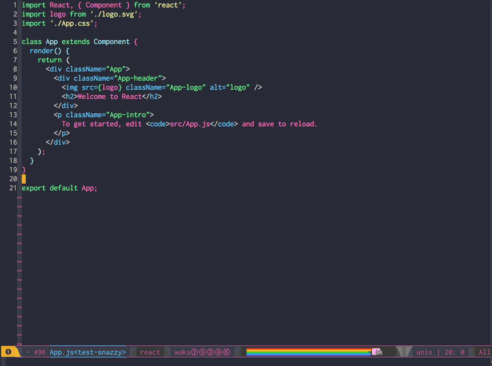

# `emacs-snazzy`

> Elegant [Emacs](https://www.gnu.org/software/emacs/) theme with bright colors, based on [hyper-snazzy](https://github.com/sindresorhus/hyper-snazzy) theme by [Sindre Sorhus](https://github.com/sindresorhus).

This is initial release and theme requires a lot of work.

## License

MIT © [Tomasz Cichociski](https://github.com/baransu)
